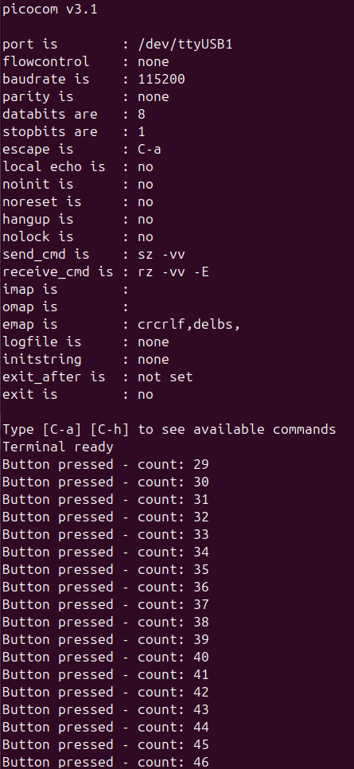

# Project 1.3: Minimal printf Implementation over UART

A lightweight `uart2_printf` function built on top of the bare-metal UART driver from Project 1.2. Supports `%d`, `%u`, `%x`, `%s`, and `%c` format specifiers with zero standard library dependencies. This turns the UART channel into a real debugging tool for every future project.

## What This Project Does

Extends the Project 1.2 UART driver with formatted output functions: integer-to-ASCII conversion (decimal, unsigned, and hexadecimal), string formatting, and a variadic `uart2_printf` that combines them all. The main loop demonstrates each format specifier alongside the LED toggle from Project 1.1.

## Why This Matters

In Project 1.2, you could print hardcoded strings. Now you can print variable values — register contents, loop counters, sensor readings, error codes. For bare-metal development without a debugger attached, `uart2_printf` is your primary window into what the firmware is doing at runtime.

The standard library `printf` from `stdio.h` pulls in ~10-20KB of code and depends on heap allocation — unacceptable on a resource-constrained microcontroller. This implementation uses ~200 bytes of flash and zero heap.

## New Functions

### uart2_write_int(int32_t value)

Converts a signed integer to its ASCII decimal representation and sends it over UART.

**The reverse-order problem:** Dividing by 10 and taking the remainder extracts digits from least-significant to most-significant (427 gives you 7, 2, 4). Solution: fill a buffer in reverse order, then send the buffer backwards.

```c
void uart2_write_int(int32_t value) {
    char buf[11]; // max: "-2147483648" = 10 chars + null
    int i = 0;
    if (value < 0) {
        uart2_write_byte('-');
        value = -value;
    }
    if (value == 0) {
        uart2_write_byte('0');
        return;
    }
    while (value > 0) {
        buf[i++] = (value % 10) + '0';  // convert digit to ASCII
        value /= 10;
    }
    while (i > 0) {
        uart2_write_byte(buf[--i]);
    }
}
```

**Key detail:** `+ '0'` converts an integer digit (0-9) to its ASCII character code ('0'=48, '1'=49, etc.).

### uart2_write_hex(uint32_t value)

Prints a 32-bit value as an 8-digit hex string prefixed with `0x`. Always prints all 8 digits (zero-padded) because in embedded debugging, seeing `0x00000000` is meaningful — it confirms the register is clear, not that output was truncated.

```c
void uart2_write_hex(uint32_t value) {
    uart2_write_string("0x");
    for (int i = 7; i >= 0; i--) {
        uint8_t nibble = (value >> (i * 4)) & 0xF;
        uart2_write_byte(nibble < 10 ? nibble + '0' : (nibble - 10) + 'A');
    }
}
```

**No buffer needed:** Unlike decimal, hex digits can be extracted most-significant first by shifting down from bit 28 to bit 0 in steps of 4. Each 4-bit nibble maps directly to one hex digit.

**There's no "hex type" in C.** `255`, `0xFF`, and `0b11111111` are the same bits in memory. Hex is just a human-readable display format — particularly useful for register values and addresses since they align with 4-bit boundaries.

### uart2_printf(const char *fmt, ...)

Parses a format string and dispatches to the appropriate write function for each `%` specifier. Uses C's variable argument mechanism (`stdarg.h`).

| Specifier | Type | Use Case |
|-----------|------|----------|
| `%d` | int (signed) | Loop counters, signed sensor deltas |
| `%u` | unsigned int | ADC readings, timer counts, buffer sizes |
| `%x` | uint32_t | Register values, addresses, bit masks |
| `%s` | char * | Status messages, labels |
| `%c` | char | Single characters, delimiters |
| `%%` | (literal) | Print a literal `%` |

**Variable arguments:** `stdarg.h` provides `va_list`, `va_start`, `va_arg`, and `va_end`. These macros let the function accept any number of arguments after the format string. `va_arg(args, type)` pulls the next argument and interprets it as the given type. The order of `va_arg` calls must match the `%` specifiers — there's no type checking.

**char promotes to int:** When `char` is passed as a variable argument, C automatically promotes it to `int`. That's why `%c` uses `va_arg(args, int)` and casts back to `char`.

## Hardware Register Side Effect Discovery

While testing `uart2_write_hex`, reading USART2_SR produced unexpected results:

```c
// Before any UART writes: SR = 0x000000C0 (TXE=1, TC=1 — idle state)
uart2_write_hex(USART2_SR);  // prints 0x000000C0 ✓

// After UART writes: SR = 0x00000000
uart2_write_string("Hello\r\n");
uart2_write_hex(USART2_SR);  // prints 0x00000000 — why?
```

**Root cause:** Reading SR followed by writing DR is a hardware-defined flag-clearing sequence. The `uart2_write_byte` function reads SR (to check TXE), then writes to DR — this clears status flags as a side effect. By the time `uart2_write_hex` reads SR again, the flags have been consumed by previous write cycles.

**Solution:** Capture the register into a variable before any print calls touch it:

```c
uint32_t sr_snapshot = USART2_SR;  // capture before writes
uart2_write_string("SR = ");
uart2_write_hex(sr_snapshot);      // print the captured value
```

**Lesson:** Hardware registers don't behave like regular memory. Reading them can have side effects. The reference manual documents these behaviors per-register in the bit descriptions.

## Code Organization

This project introduced enough functions to warrant splitting into separate files:

```
project-1.3-printf/
├── Src/
│   ├── main.c          # Init + main loop
│   └── uart2.c         # All UART functions
├── Inc/
│   └── uart2.h         # Function prototypes + USART2 defines
│   └── stm32f407xx.h   # Register base addresses + register defines for the chip
├── startup/
│   └── startup_stm32f407.s
├── linker/
│   └── stm32f407.ld
├── Makefile
└── README.md
```

**Header include path:** Instead of `#include "../Inc/uart2.h"`, add `-I./Inc` to CFLAGS in the Makefile. Then `#include "uart2.h"` works from any source file.

**Include guards:** Every header uses the `#ifndef`/`#define`/`#endif` pattern to prevent duplicate declarations if the header is included from multiple source files.

## Makefile Changes from 1.2

- Added `uart2.c` to source file list
- Added `-I./Inc` to CFLAGS for header search path

## Build and Test

```bash
make
make flash
picocom -b 115200 /dev/ttyUSB0
```

# Expected Output


## What I Learned

- **No separate hex type:** Hex, decimal, and binary are display formats, not data types. `0xFF` and `255` are identical bits in memory. The function determines how to display them.
- **Hardware registers have read side effects:** The USART SR clear-on-read-then-write behavior surprised me. Always check the reference manual's bit descriptions — "cleared by a read to SR followed by a write to DR" is easy to miss.
- **Snapshot registers before printing:** If you need to inspect a register value, capture it into a local variable first. Using `uart2_write_hex(USART2_SR)` directly may give stale results because the print functions themselves read SR internally.
- **stdint.h has no runtime cost:** It's pure type definitions resolved at compile time. In embedded, you always want fixed-width types (`uint32_t` not `unsigned int`) because they make size guarantees explicit.
- **Variable arguments are unsafe:** No type checking between format specifiers and actual arguments. Mismatched types produce garbage or crashes silently.
- **Organize early:** Splitting UART code into its own .c/.h pair keeps main.c clean and makes the functions reusable across future projects by copying the files.

## Documentation References

| Document | Section | What I Used It For |
|----------|---------|-------------------|
| **RM0090** | §30 USART | SR flag-clearing behavior (read SR + write DR sequence) |
| **C Standard** | stdarg.h | va_list, va_start, va_arg, va_end for variable arguments |
| **C Standard** | stdint.h | Fixed-width types (uint32_t, int32_t, uint8_t) |
| **ASCII Table** | — | Character code offsets: '0'=48, 'A'=65 |

## Previous Projects

- [Project 1.1: Bare-Metal LED Toggle](../project-1.1-led/README.md)
- [Project 1.2: Bare-Metal UART](../project-1.2-uart/README.md)